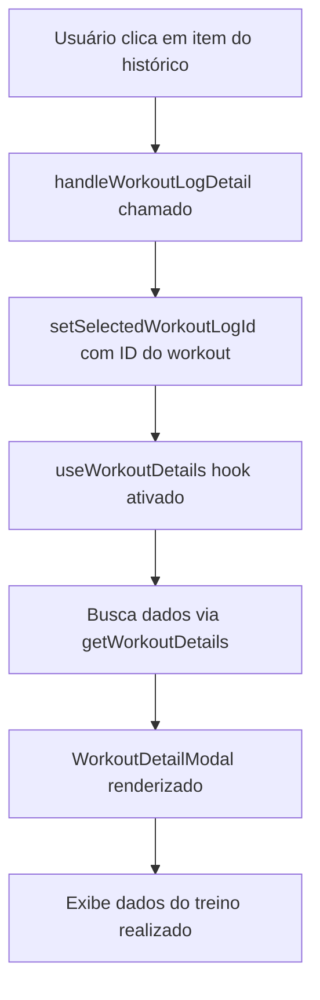

# História: Refinamento UX do Histórico de Treinos - Melhorias Visuais e Modal

**Status:** Pronto para Desenvolvimento 📋

**Prioridade:** Média-Alta

**Tamanho:** Pequeno (Brownfield Enhancement)

**Componente:** Dashboard > Treino > Histórico

**Epic:** Módulo de Treino Personalizado

## User Story

**Como** usuário da plataforma Aleen,  
**Eu quero** visualizar meu histórico de treinos com design limpo (sem cards aninhados) e poder clicar em qualquer treino para ver seus detalhes completos em um modal,  
**Para que** eu possa revisar facilmente meus treinos passados e acompanhar meu progresso de forma intuitiva.

## Contexto do Sistema

### Situação Atual
- ✅ Módulo de treino implementado e funcionando
- ⚠️ Histórico apresenta visual de "card dentro de card" (confuso)
- ⚠️ Modal de detalhes do treino não é acionado pelo histórico
- ✅ Componentes e hooks já existem (WorkoutDetailModal, useWorkoutDetails)

### Integração Existente
- **Componentes:** TreinoTab.tsx, WorkoutHistoryItem.tsx, WorkoutDetailModal.tsx
- **Hooks:** useWorkoutHistory, useWorkoutDetails já implementados
- **Padrão:** Modal já usado para detalhes de templates de treino
- **Dados:** Integração com Supabase via lib/training.ts funcionando

## Problemas Identificados

### Problema 1: Visual Confuso do Histórico
**Situação:** WorkoutHistoryItem está com aparência de card aninhado dentro de outro card
**Impacto:** Usuário fica confuso sobre onde clicar, visual poluído
**Evidência:** Imagem fornecida mostra cards sobrepostos

### Problema 2: Modal Não Funcional no Histórico  
**Situação:** Existe WorkoutDetailModal mas não é acionado quando clica no histórico
**Impacto:** Usuário não consegue ver detalhes dos treinos realizados
**Evidência:** Modal funciona para templates mas não para workout logs

## Critérios de Aceitação

### AC1: Visual Limpo do Histórico ✨
**DADO** que tenho treinos no meu histórico  
**QUANDO** visualizo a seção "Histórico de Treinos"  
**ENTÃO** devo ver:
- Lista limpa sem aparência de cards aninhados
- Cada item como um elemento de lista simples e clicável
- Visual consistente com o resto da aplicação Aleen
- Hover states que indicam que é clicável

### AC2: Modal de Detalhes Funcional 🔍
**DADO** que visualizo o histórico de treinos  
**QUANDO** clico em qualquer item do histórico  
**ENTÃO** devo ver:
- Modal abrindo com detalhes completos do treino realizado
- Dados carregados via useWorkoutDetails(workoutLogId)
- Lista de exercícios realizados com séries, reps e cargas
- Data e duração do treino
- Botão para fechar o modal (X, overlay, ESC)

### AC3: Consistência e Performance 🚀
**DADO** que uso o modal de histórico  
**QUANDO** interajo com a funcionalidade  
**ENTÃO** devo ter:
- Loading state enquanto carrega dados do treino
- Tratamento de erro se falhar carregamento
- Modal responsivo (mobile e desktop)
- Experiência idêntica ao modal de template de treino

## Especificação Técnica Detalhada

### Arquivos a Modificar

#### 1. `components/dashboard/training/WorkoutHistoryItem.tsx`
**Objetivo:** Corrigir visual e adicionar funcionalidade de clique

**Mudanças Necessárias:**
```typescript
// Adicionar props para callback de clique
interface WorkoutHistoryItemProps {
  workout: WorkoutLogWithDetails
  onDetailClick: (workoutLogId: string) => void // NOVO
}

// Modificar styling para remover aparência de card aninhado
// Adicionar onClick handler
// Adicionar hover states apropriados
```

**Visual Target:**
- Remover bordas/sombras que criam impressão de card
- Usar padding/margin mais sutil
- Adicionar cursor pointer e hover effect
- Manter informações essenciais: data, nome, duração

#### 2. `components/dashboard/tabs/TreinoTab.tsx`
**Objetivo:** Adicionar estado de modal para workout logs

**Mudanças Necessárias:**
```typescript
// Adicionar estado para modal de workout log
const [selectedWorkoutLogId, setSelectedWorkoutLogId] = useState<string | null>(null)

// Handlers para abrir/fechar modal
const handleWorkoutLogDetail = (workoutLogId: string) => {
  setSelectedWorkoutLogId(workoutLogId)
}

const handleCloseWorkoutLogModal = () => {
  setSelectedWorkoutLogId(null)
}

// Passar callback para WorkoutHistoryItem
// Renderizar WorkoutDetailModal para workout logs
```

**Padrão a Seguir:**
- Usar mesmo padrão do modal de template existente
- Manter consistência na gestão de estado
- Aplicar mesmo patrão de props do WorkoutDetailModal

### Fluxo de Dados



### Hooks Utilizados (Já Existentes)

#### `useWorkoutDetails(workoutLogId: string)`
- **Localização:** `hooks/training/useWorkoutDetails.ts`
- **Funcionalidade:** Busca detalhes completos de um workout log
- **Retorno:** `{ workout, loading, error }`
- **Status:** ✅ Já implementado e funcionando

#### `useWorkoutHistory(userId: string)`
- **Localização:** `hooks/training/useWorkoutHistory.ts`  
- **Funcionalidade:** Lista histórico paginado
- **Status:** ✅ Já implementado e funcionando

### Componentes Utilizados (Já Existentes)

#### `WorkoutDetailModal`
- **Localização:** `components/dashboard/training/WorkoutDetailModal.tsx`
- **Funcionalidade:** Modal para exibir detalhes de treino
- **Props Necessárias:** `isOpen`, `onClose`, `workoutData`
- **Status:** ✅ Já implementado, precisa integração

## Implementação Passo a Passo

### Passo 1: Corrigir Visual do WorkoutHistoryItem
```typescript
// Remover classes que criam aparência de card aninhado
// Exemplo de classes a ajustar:
className="hover:bg-muted/50 transition-colors cursor-pointer p-4 rounded-lg border-l-4 border-aleen-blue"
// Em vez de card com sombra/borda completa
```

### Passo 2: Adicionar onClick Handler
```typescript
// No WorkoutHistoryItem
<div 
  onClick={() => onDetailClick(workout.id)}
  className="hover:bg-muted/50 transition-colors cursor-pointer..."
>
  {/* conteúdo existente */}
</div>
```

### Passo 3: Integrar Modal no TreinoTab
```typescript
// Estado do modal
const [selectedWorkoutLogId, setSelectedWorkoutLogId] = useState<string | null>(null)

// Renderizar modal condicionalmente
{selectedWorkoutLogId && (
  <WorkoutDetailModal
    isOpen={!!selectedWorkoutLogId}
    onClose={() => setSelectedWorkoutLogId(null)}
    workoutLogId={selectedWorkoutLogId}
  />
)}
```

### Passo 4: Conectar Dados
```typescript
// No WorkoutDetailModal, usar o hook existente
const { workout, loading, error } = useWorkoutDetails(workoutLogId)
```

## Definição de Pronto (DoD)

### Funcional ✅
- [ ] Histórico visual aparece como lista limpa (sem cards aninhados)
- [ ] Clique em item do histórico abre modal de detalhes
- [ ] Modal carrega dados corretos usando useWorkoutDetails
- [ ] Modal pode ser fechado (X, overlay, ESC)
- [ ] Estados de loading/error tratados adequadamente

### Visual 🎨
- [ ] Design consistente com identidade Aleen
- [ ] Hover states apropriados no histórico
- [ ] Modal responsivo (mobile/desktop)
- [ ] Transições suaves entre estados

### Técnico 💻
- [ ] TypeScript compila sem erros
- [ ] Nenhuma regressão em funcionalidade existente
- [ ] Performance mantida (< 1s para abrir modal)
- [ ] Build de produção funciona corretamente

### Testes 🧪
- [ ] Teste manual: clicar em diferentes itens do histórico
- [ ] Teste: modal abre/fecha corretamente
- [ ] Teste: dados corretos exibidos no modal
- [ ] Teste: responsividade mobile/desktop

## Estimativa e Tempo

**Story Points:** 3 (Pequeno)  
**Tempo Estimado:** 2-3 horas de desenvolvimento  
**Complexidade:** Baixa (usa componentes existentes)

## Riscos e Mitigações

### Riscos Identificados
1. **Quebrar funcionalidade existente** durante mudanças visuais
2. **Inconsistência visual** com resto da aplicação
3. **Performance** se modal for pesado

### Mitigações
1. **Testes manuais** após cada mudança
2. **Seguir padrões existentes** do modal de template
3. **Usar hooks existentes** que já são otimizados

## Dependências

### Pré-requisitos ✅
- [x] Módulo de treino base implementado
- [x] WorkoutDetailModal existe e funciona
- [x] useWorkoutDetails hook implementado
- [x] useWorkoutHistory funcionando
- [x] TreinoTab estrutura base pronta

### Não Depende De
- ❌ Mudanças no banco de dados
- ❌ Novos componentes UI
- ❌ Novos hooks ou serviços
- ❌ Mudanças na API

## Validação com Stakeholders

### Critérios de Aceitação Visual
- Histórico deve parecer "lista simples" não "cards empilhados"
- Modal deve abrir suavemente ao clicar
- Informações do treino devem estar completas e claras

### Experiência do Usuário Target
1. **Escaneabilidade:** Histórico fácil de escanear visualmente
2. **Descoberta:** Claro que itens são clicáveis
3. **Detalhe:** Modal fornece informações completas do treino
4. **Fluidez:** Interação rápida e responsiva

## Notas para o Desenvolvedor

### Pontos de Atenção 🎯
1. **Manter padrão existente** do modal de template de treino
2. **Não quebrar** funcionalidade de paginação do histórico
3. **Usar classes CSS** consistentes com design system
4. **Testar responsividade** em diferentes tamanhos de tela

### Referências de Código 📚
- Ver `TreinoTab.tsx` linhas onde modal de template é implementado
- Seguir mesmo padrão de estado e handlers
- Usar mesma estrutura de props no WorkoutDetailModal
- Manter consistência visual com outros componentes

### Resultado Esperado 🎯
- **Visual limpo** no histórico (problema resolvido)
- **Modal funcional** para detalhes (problema resolvido)
- **UX consistente** com resto da aplicação
- **Zero regressões** em funcionalidade existente

---

**📋 História pronta para implementação pelo desenvolvedor!**

**Próximo passo:** Desenvolver as mudanças seguindo esta especificação detalhada
