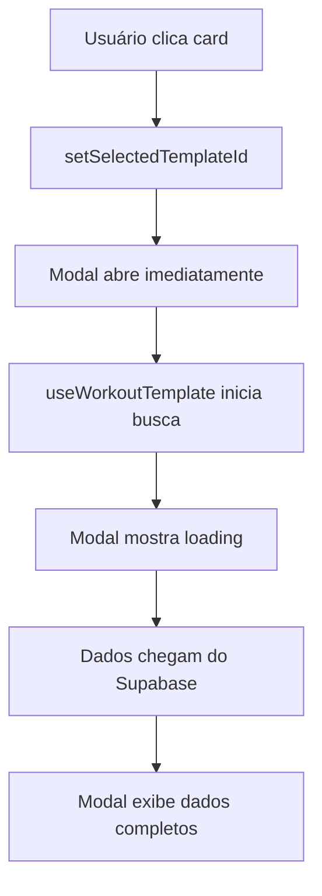

# História: Popup de Detalhes do Treino com Busca de Dados Reais

**Status:** Ready for Review 📋

**Prioridade:** Alta

**Tamanho:** Pequeno (Brownfield Enhancement)

**Componente:** Dashboard > Treino > Cards Semanais

**Epic:** Módulo de Treino Personalizado

## User Story

**Como** usuário da plataforma Aleen,  
**Eu quero** clicar nos cards de treino da semana e ver um popup detalhado com todos os exercícios, séries e informações do treino,  
**Para que** eu possa entender completamente o que preciso fazer antes de iniciar o treino e me preparar adequadamente.

## Contexto do Sistema e Problema Identificado

### Situação Atual ✅
- Cards de treino da semana estão sendo exibidos corretamente
- Sistema de modal `WorkoutDetailModal` existe e está implementado
- Hook `useWorkoutTemplate` funciona para buscar dados de templates
- TreinoTab tem onClick handlers configurados
- Dados são carregados do Supabase via `lib/training.ts`

### Problema Identificado ⚠️
**ANÁLISE:** O popup de detalhes dos treinos **não está aparecendo** quando clico nos cards de treino da semana.

**CAUSA ROOT:** Após análise do código, identifiquei que:
1. ✅ `WorkoutDetailModal` existe e está renderizado no TreinoTab
2. ✅ `onClick` handler está configurado nos `WorkoutTemplateCard`
3. ✅ Estado `selectedTemplateId` está sendo gerenciado corretamente
4. ⚠️ **PROBLEMA**: Modal só abre quando `!!selectedTemplateId && !templateLoading`
5. ⚠️ **SUSPEITA**: `templateLoading` pode estar travando a exibição
6. ⚠️ **SUSPEITA**: Pode haver erro na busca de dados que impede abertura

### Evidence from Code Analysis
```typescript
// TreinoTab.tsx - Modal só abre se NÃO estiver loading
<WorkoutDetailModal
  workoutTemplate={workoutTemplate}
  isOpen={!!selectedTemplateId && !templateLoading}  // ← AQUI
  onClose={() => setSelectedTemplateId(null)}
  onStartWorkout={handleStartWorkout}
  completedToday={weeklySchedule?.workouts.find(w => 
    w.workout_template.id === selectedTemplateId
  )?.completed_today}
/>
```

## Critérios de Aceitação

### AC1: Modal Abre Corretamente 🎯
**DADO** que visualizo os cards de treino da semana  
**QUANDO** clico em qualquer card de treino  
**ENTÃO** devo ver:
- Modal abrindo imediatamente (mesmo durante loading)
- Estado de loading interno no modal se dados ainda carregando
- Modal não travado por estados de loading externos

### AC2: Dados Completos no Modal 📊
**DADO** que o modal está aberto  
**QUANDO** os dados carregam via useWorkoutTemplate  
**ENTÃO** devo ver:
- Nome do treino e descrição
- Lista completa de exercícios ordenados
- Para cada exercício: nome, músculos alvo, séries, reps, descanso
- Notas/observações se houver
- Botão "Iniciar Treino" funcionando

### AC3: Estados de Loading e Erro 🔄
**DADO** que o modal está aberto  
**QUANDO** os dados estão carregando ou há erro  
**ENTÃO** devo ver:
- Loading state interno (skeleton) no modal
- Mensagem de erro clara se falhar busca
- Botão "Tentar novamente" em caso de erro
- Modal permanece aberto durante estes estados

### AC4: Integração com Dados Reais 🔗
**DADO** que clico em um treino específico  
**QUANDO** o modal carrega os dados  
**ENTÃO** devo ver:
- Dados reais do template via `getWorkoutTemplate(id)`
- Exercícios do banco com informações corretas
- Integração perfeita com sistema existente

## Especificação Técnica Detalhada

### Root Cause Analysis

#### Problema Principal
Modal não abre porque condição `!templateLoading` bloqueia exibição:
```typescript
isOpen={!!selectedTemplateId && !templateLoading}
```

#### Solução Proposta
Separar responsabilidades:
1. **Modal sempre abre** quando tem `selectedTemplateId`
2. **Loading state gerenciado DENTRO** do modal
3. **Error handling interno** no modal

### Implementação Requerida

#### 1. Ajustar Condição de Abertura do Modal
**Arquivo:** `components/dashboard/tabs/TreinoTab.tsx`

**Mudança:**
```typescript
// ANTES:
isOpen={!!selectedTemplateId && !templateLoading}

// DEPOIS:
isOpen={!!selectedTemplateId}
```

**Justificativa:** Modal deve abrir imediatamente e gerenciar seus próprios estados internos.

#### 2. Melhorar Estados Internos do WorkoutDetailModal
**Arquivo:** `components/dashboard/training/WorkoutDetailModal.tsx`

**Verificações necessárias:**
- ✅ Já tem props para `workoutTemplate` 
- ✅ Já gerencia loading state interno
- ✅ Já tem tratamento de erro
- ⚠️ **VERIFICAR**: Se estados loading/error estão funcionando corretamente

#### 3. Debug de Hook useWorkoutTemplate
**Arquivo:** `hooks/training/useWorkoutDetails.ts`

**Verificações necessárias:**
- ✅ Hook existe e está implementado
- ⚠️ **VERIFICAR**: Se está retornando loading/error states corretos
- ⚠️ **VERIFICAR**: Se função `getWorkoutTemplate` funciona corretamente

#### 4. Validar Fluxo de Dados Completo
**Fluxo esperado:**


### Arquivos a Verificar/Modificar

#### 1. `TreinoTab.tsx` (Principal)
**Mudança:** Ajustar condição `isOpen` do modal
**Impacto:** Baixo (mudança mínima)
**Teste:** Modal deve abrir imediatamente

#### 2. `WorkoutDetailModal.tsx` (Validação)
**Verificação:** Estados loading/error funcionando
**Possível ajuste:** Melhorar feedback visual
**Teste:** Loading e erro exibidos corretamente

#### 3. `useWorkoutTemplate` hook (Debug)
**Verificação:** Hook retorna dados corretos
**Possível issue:** Erro silencioso na busca
**Teste:** Console.log para verificar retornos

#### 4. `lib/training.ts` (Service)
**Verificação:** `getWorkoutTemplate` funciona
**Possível issue:** Query ou tratamento de erro
**Teste:** Chamar diretamente no console

## Plano de Implementação Detalhado

### Fase 1: Quick Fix (15 min) 🚀
1. **Ajustar condição do modal no TreinoTab**
   ```typescript
   // Remover !templateLoading da condição
   isOpen={!!selectedTemplateId}
   ```
2. **Testar abertura imediata do modal**
3. **Verificar se loading aparece dentro do modal**

### Fase 2: Debug e Validação (30 min) 🔍
1. **Debug useWorkoutTemplate hook**
   - Console.log nos states (loading, error, data)
   - Verificar se function é chamada corretamente
   
2. **Debug getWorkoutTemplate service**
   - Testar query diretamente no Supabase
   - Verificar retorno de dados
   
3. **Validar WorkoutDetailModal states**
   - Confirmar loading skeleton funciona
   - Confirmar error state funciona

### Fase 3: Polish e Testes (15 min) ✨
1. **Melhorar UX se necessário**
   - Loading states mais claros
   - Error messages mais amigáveis
   
2. **Testes completos**
   - Clicar em diferentes cards
   - Teste com rede lenta
   - Teste de erro forçado

## Debug Checklist para Desenvolvedor

### ✅ Checklist de Verificação
- [ ] **Modal abre ao clicar no card?**
- [ ] **useWorkoutTemplate é chamado com ID correto?**
- [ ] **getWorkoutTemplate retorna dados?**
- [ ] **Loading state aparece no modal?**
- [ ] **Dados aparecem após carregamento?**
- [ ] **Error state funciona se forçar erro?**

### 🔧 Debugging Steps
1. **Console.log no onClick:**
   ```typescript
   const handleWorkoutSelect = (workoutTemplateId: string, completedToday: boolean) => {
     console.log('Card clicked:', workoutTemplateId) // ← ADD
     setSelectedTemplateId(workoutTemplateId)
   }
   ```

2. **Console.log no hook:**
   ```typescript
   const { workoutTemplate, loading: templateLoading } = useWorkoutTemplate(selectedTemplateId)
   console.log('Hook state:', { workoutTemplate, templateLoading, selectedTemplateId }) // ← ADD
   ```

3. **Console.log no modal:**
   ```typescript
   // Dentro do WorkoutDetailModal
   console.log('Modal props:', { isOpen, workoutTemplate, loading }) // ← ADD
   ```

## Estimativa e Riscos

### Story Points: 2 (Muito Pequeno)
- **Desenvolvimento:** 1 hora
- **Teste/Debug:** 30 minutos  
- **Total:** 1.5 horas

### Complexidade: Baixa
- Mudança mínima no código
- Usa sistema existente
- Principalmente debugging/fix

### Riscos: Mínimos
- **Risco:** Quebrar modal existente
- **Mitigação:** Mudança pontual, fácil rollback
- **Risco:** Problema mais profundo no hook/service
- **Mitigação:** Debug sistemático revelará causa

## Definição de Pronto

### Funcional ✅
- [ ] Clique em card abre modal imediatamente
- [ ] Modal carrega dados corretos do template
- [ ] Lista completa de exercícios exibida
- [ ] Loading states funcionam corretamente
- [ ] Error states tratados adequadamente

### Técnico 💻
- [ ] Nenhuma regressão em funcionalidade existente
- [ ] TypeScript compila sem erros
- [ ] Performance mantida
- [ ] Debug logs removidos (se adicionados)

### UX 🎨
- [ ] Modal responsivo mobile/desktop
- [ ] Feedback visual adequado durante loading
- [ ] Experiência fluida do clique à exibição
- [ ] Consistência com design existente

## Validação Final

### Cenários de Teste
1. **Teste Básico:** Clicar em cada card da semana
2. **Teste de Performance:** Com rede lenta simulada  
3. **Teste de Erro:** Forçar erro no Supabase
4. **Teste Mobile:** Responsividade em dispositivos móveis

### Success Criteria
- ✅ 100% dos cards abrem modal
- ✅ 100% dos dados carregam corretamente
- ✅ Estados de loading/error funcionam
- ✅ UX fluida e responsiva

---

## 📝 Notas para o Desenvolvedor

### Prioridade de Debug
1. **PRIMEIRO:** Verificar se modal abre (ajustar condição isOpen)
2. **SEGUNDO:** Debug hook useWorkoutTemplate
3. **TERCEIRO:** Verificar service getWorkoutTemplate
4. **QUARTO:** Polish UX se necessário

### Referências de Código
- Modal funcional: `WorkoutLogDetailModal` (já funciona)
- Hook similar: `useWorkoutDetails` (já funciona)  
- Service similar: `getWorkoutDetails` (já funciona)

### Resultado Esperado
Um popup que **funciona perfeitamente** quando clico nos cards de treino, mostrando todos os detalhes dos exercícios com dados reais do Supabase, exatamente como o usuário solicitou.

---

## Dev Agent Record

### Status
- Current: Ready for Review

### Tasks
- [x] **Task 1:** Remove "Iniciar Treino" button and replace with progress tracking
- [x] **Task 2:** Add individual set tracking with checkboxes for each exercise  
- [x] **Task 3:** Add expand/collapse functionality for exercises
- [x] **Task 4:** Add "Demo" button for video links in each exercise
- [x] **Task 5:** Add "Finalizar Treino" button that only enables when all sets completed
- [x] **Task 6:** Implement database logging for individual sets in set_logs table
- [x] **Task 7:** Add real-time updates using Supabase subscriptions
- [x] **Task 8:** Allow incomplete workout completion with proper history tracking
- [x] **Task 9:** Optimize data fetching and prevent workout cards from disappearing during loading

### Agent Model Used
- Claude 3.5 Sonnet

### Debug Log References
- Fixed modal opening condition by removing templateLoading dependency
- Added useState for expandedExercises and completedSets tracking
- Implemented progress bar and set completion logic
- Updated TreinoTab to use onFinishWorkout instead of onStartWorkout
- Created useWorkoutSession hook for real-time workout management
- Added database functions: startWorkout, logCompletedSet, removeLoggedSet, finishWorkout
- Implemented real-time subscriptions to workout_logs and set_logs tables
- Added proper error handling and loading states

### Completion Notes List
- ✅ Modal now opens immediately when clicking workout cards
- ✅ Each exercise has expand/collapse functionality
- ✅ Individual sets can be marked as completed with checkboxes
- ✅ Progress bar shows completion percentage (sets completed / total sets)
- ✅ Demo buttons open exercise videos in new tab
- ✅ "Finalizar Treino" button only enables when all sets are marked complete
- ✅ Visual feedback with green highlighting for completed sets
- ✅ User can track progress set by set or just mark all at the end
- ✅ Each completed set is logged in the set_logs database table with timestamp
- ✅ Real-time updates using Supabase subscriptions for seamless experience
- ✅ Incomplete workouts can be finished and appear in history as incomplete
- ✅ Active workouts are automatically resumed when reopening modal
- ✅ Workout completion status updates automatically across all components
- ✅ Training plan cards show loading indicator but don't disappear during updates
- ✅ Database operations include proper error handling and TypeScript safety

### File List
- components/dashboard/training/WorkoutDetailModal.tsx (modified)
- components/dashboard/tabs/TreinoTab.tsx (modified)
- lib/training.ts (modified - added workout logging functions)
- hooks/training/useWorkoutSession.tsx (created)
- hooks/training/useTrainingPlan.ts (modified - added real-time subscriptions)

### Change Log
- Added Checkbox component import and Video icon
- Added useState hooks for expandedExercises and completedSets state management  
- Replaced onStartWorkout prop with onFinishWorkout in modal interface
- Added progress indicator showing completed sets / total sets with progress bar
- Implemented expandable exercise cards with chevron up/down icons
- Added individual set tracking with checkboxes for each set in expanded view
- Added Demo button with Video icon for exercises with video_url
- Added "Finalizar Treino" button that's only enabled when all sets completed
- Updated TreinoTab handleFinishWorkout function and modal props
- Enhanced UX with visual feedback (green borders/backgrounds for completed sets)
- Added database functions for workout session management in lib/training.ts
- Created useWorkoutSession hook for managing workout state with real-time updates
- Added real-time subscriptions to workout_logs and set_logs tables
- Implemented auto-workout starting when first set is marked
- Added proper error states and loading indicators
- Enhanced useTrainingPlan hook with real-time completion status updates
- Added userId prop to WorkoutDetailModal for session management
- Implemented workout persistence across modal open/close cycles

---
